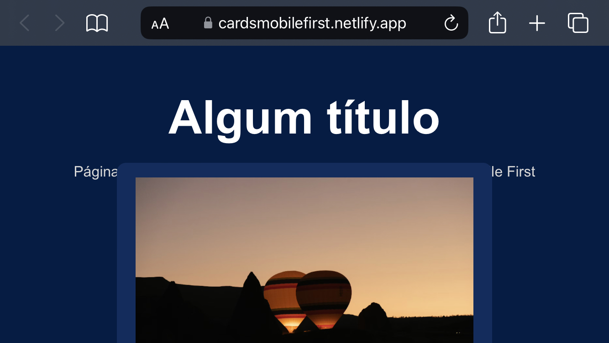

# Mobile-first-test

## SSI 2024 - Exercício 1
> Criar uma página responsiva utilizando somente HTML e CSS puros que contenha (no mínimo) 3 cards, com cada card sendo composto por (pelo menos) um parágrafo e uma imagem.
> A página deve ser criada seguindo o conceito de mobile first e utilizando o layout flexbox. É FUNDAMENTAL que sejam usadas apenas condições baseadas no tamanho mínimo (min-width) para a definição das media queries.

> [!WARNING]
> Prestar atenção nisso daqui, Karina!!
> O card está sobrepondo o conteúdo do header, mais especificamente o parágrafo, na versão mobile quando exibido na orientação horizontal :+1:
> 

~~Tô com preguiça de arrumar~~